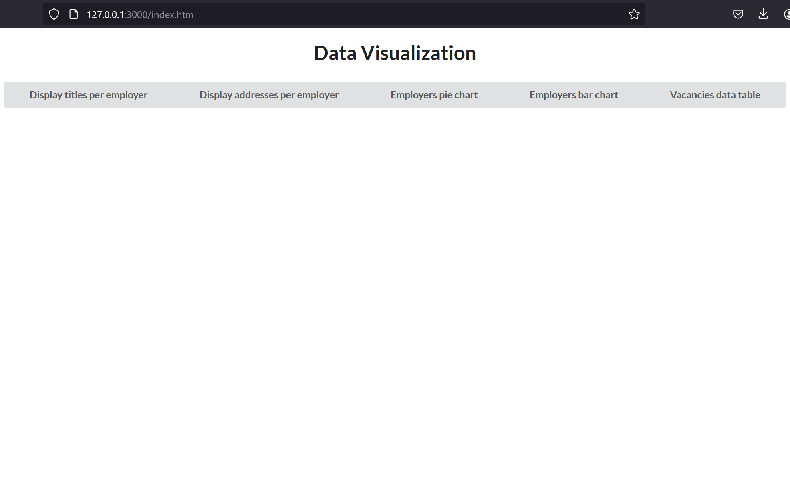
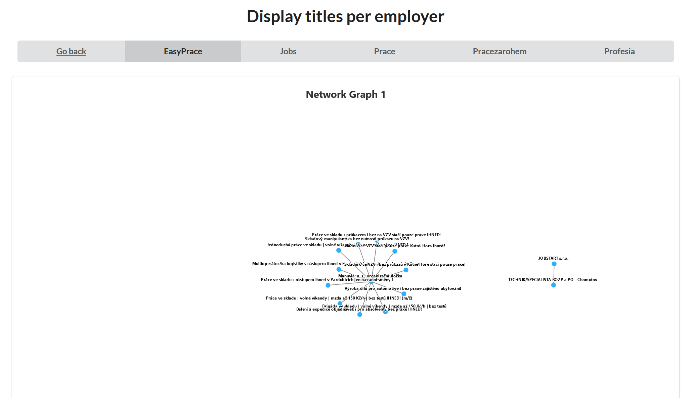
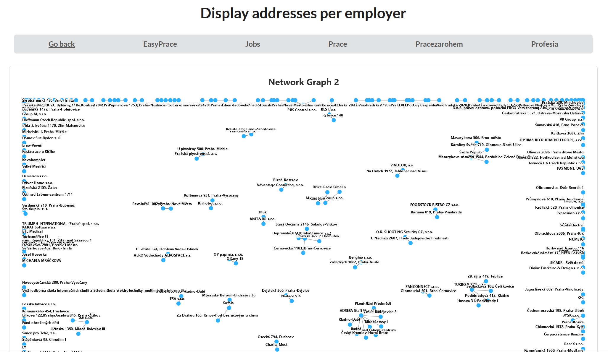
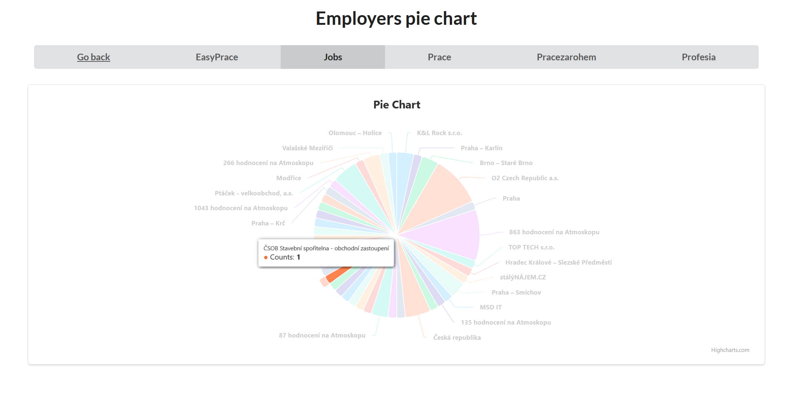
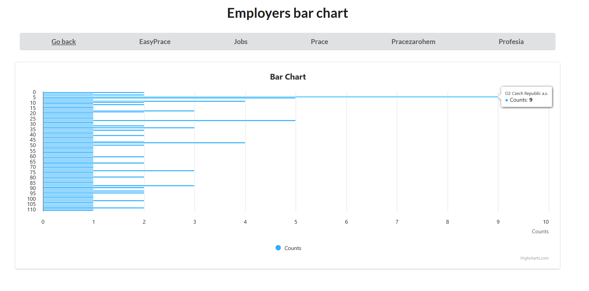
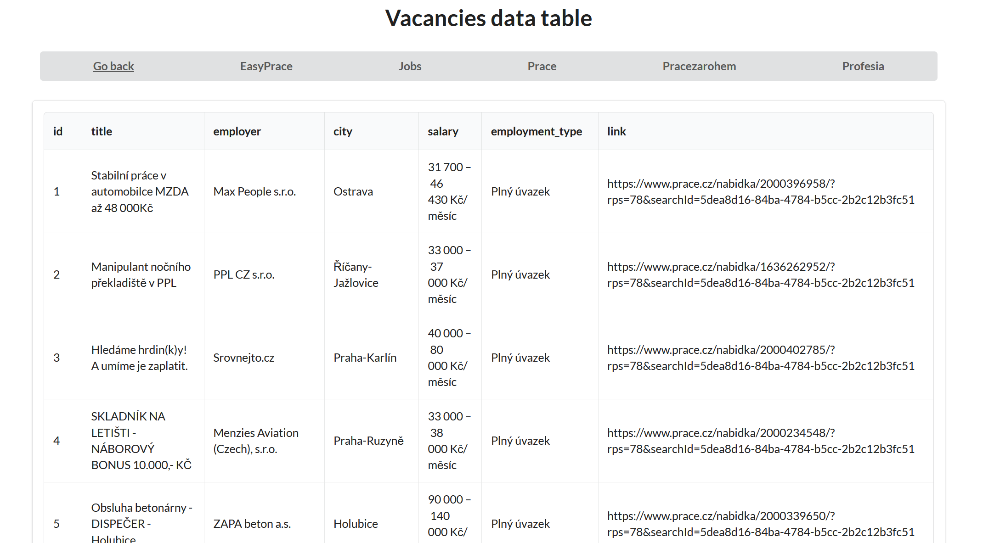

## Czech vacancies aggregator
### Description
Web-application to get information about czech job vacancies and analyze it with visualization tools using JavaScript and PostgreSQL.

The data is collected by scrapers using Axios and Cheerio, stored in PostgreSQL database using Sequelize. Web-application frontend includes diagrams (graphs) from Highcharts and page elements from Semantic UI. Backend is built## Czech vacancies aggregator
### Description
Web-application to get information about czech job vacancies and analyze it with visualization tools using JavaScript and PostgreSQL.

The data is collected by scrapers using Axios and Cheerio, stored in PostgreSQL database using Sequelize. Web-application frontend includes diagrams (graphs) from Highcharts and page elements from Semantic UI. Backend is built with Express.
### Here are some screnshots
#### The main page:

#### Network graph to display titles per employer:

#### Network graph to display vacancy addresses per employer:

#### Pie chart to display vacancies quantity per employer:

#### Bar chart to display vacancies quantity per employer:

#### Data grid (or simply table) with all information about vacancies:

### How to start an app
Download the project as ZIP or clone using "git clone https://github.com/xebit8/czech-vacancies-aggregator.git".

Check if you have Node.js installed on your computer.

Check if you have PostgreSQL installed on your computer.

Use "npm install" to download all my dependencies from package.json.

Create new database (using pgAdmin 4 for example). Change database authorization data (database name, PostgreSQL username, PostgreSQL password) in general/connect.js on yours.

It is recommended to run project in this order:
1. "node general/synchronize_tables.js" to create tables for database.
2. "node easyprace/save_easyprace.js" to start collecting Easy-prace.cz data and saving it to database.
3. "node jobs/save_jobs.js" to start collecting Jobs.cz data and saving it to database.
4. "node prace/save_prace.js" to start collecting Prace.cz data and saving it to database.
5. "node pracezarohem/save_pracezarohem.js" to start collecting Pracezarohem.cz data and saving it to database.
6. "node profesia/save_profesia.js" to start collecting Profesia.cz data and saving it to database.
7. "node web/server.js" to start web application. After that you can open browser and navigate to localhost:3000.
 with Express.
### Here are some screnshots
#### The main page:

#### Network graph to display titles per employer:

#### Network graph to display vacancy addresses per employer:

#### Pie chart to display vacancies quantity per employer:

#### Bar chart to display vacancies quantity per employer:

#### Data grid (or simply table) with all information about vacancies:

